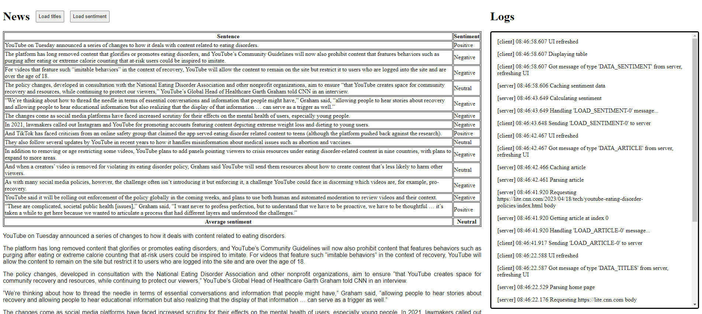

# NewsSentiment
This is a project to analyze the sentiment of news articles. The project sources articles from [CNN](https://lite.cnn.com/). Users can view articles and their sentiment scores. Users can also see logs from the server, displaying progress of article analysis in real time, thanks to the websocket connection with the server. The sentiment data is cached to avoid processing the same article multiple times.
## Demo

## Dependencies
- [stanford-corenlp](https://stanfordnlp.github.io/CoreNLP/) - sentiment analysis
- [jsoup](https://jsoup.org/) - parsing HTML
- [Java-WebSocket](https://github.com/TooTallNate/Java-WebSocket) - WebSocket implementation
- [gson](https://github.com/google/gson) - serializing data between backend and frontend
